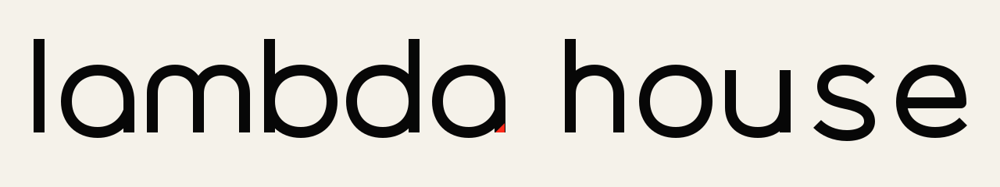
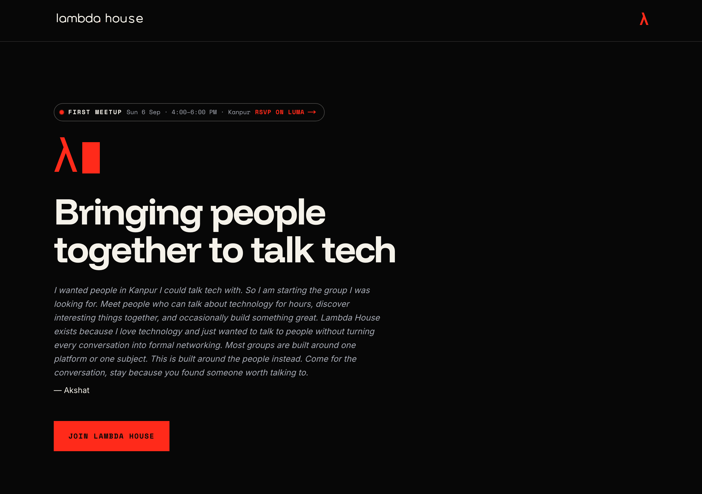

  <picture>
    <source media="(prefers-color-scheme: dark)" srcset="public/brand/lambda-house-wordmark-dark.svg">
    <source media="(prefers-color-scheme: light)" srcset="public/brand/lambda-house-wordmark-warm.svg">
    
  </picture>

  <strong>A home for people curious about technology.</strong> 
  First chapter: Kanpur.

---

## What this is

Lambda House is a community for people who like talking about technology. Not a
course, not a startup, not a networking event. Just people who find this stuff
interesting, in a room together.

You do not need to write code. You do not need a job in tech, a degree, or
anything to show. Curiosity is genuinely the only requirement, and the site
says so because it is true.

The first meetup is **Sunday, 6 September 2026, 4:00–6:00 PM, in Kanpur**. It
is free.

## The website

  

## Come along

- **[Join on WhatsApp](https://chat.whatsapp.com/El6ybbYnyhL90MMudkbV1G)**
- **[RSVP for the first meetup](https://luma.com/3sew60e5)**
- **[Instagram](https://www.instagram.com/thelambdahouse)**
- Email: joinlambdahouse@gmail.com
